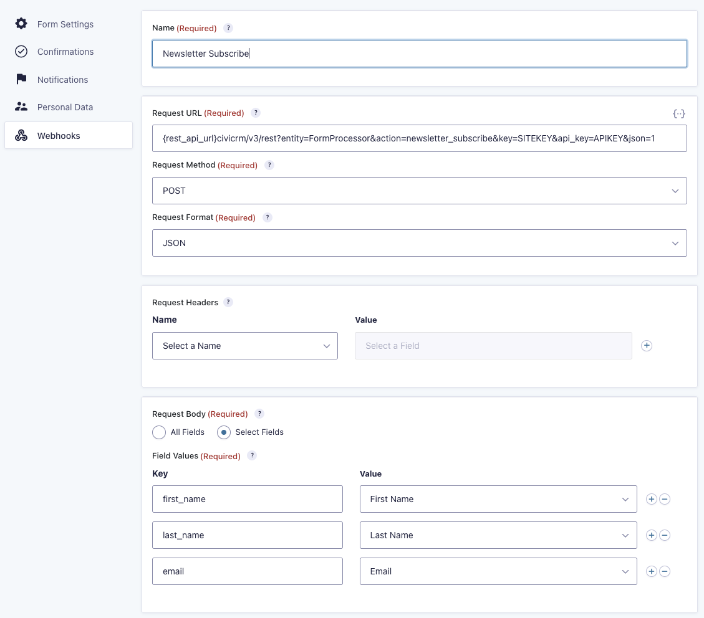

# Gravity Forms CiviCRM Integration

This is a [WordPress](https://wordpress.org) plugin that integrates the [Gravity Forms plugin](https://www.gravityforms.com/) with [CiviCRM](https://civicrm.org) using the [Form Processor extension](https://civicrm.org/extensions/form-processor).

Provides the following features:
* Extends Gravity Forms to get option lists and defaults from linked CiviCRM Form Processors
* Will detect if the submitting user is logged in and if so, use their CiviCRM API Key for the form submission

# Requirements

Integration with the CiviCRM Form Processor uses Web Hooks, which requires the [Gravity Forms, Webhooks Add-on](https://www.gravityforms.com/add-ons/webhooks/). This add-on is currently bundled with the [Gravity Forms, Elite License](https://www.gravityforms.com/elite-license-plan/)

# Setting up a Newsletter Subscription form using Gravity Forms and CiviCRM

Use the following steps to set up a _Newsletter Subscription_ form using the example configuration provided.

1. In WordPress, install and enable this plugin.
2. On the CiviCRM Extensions page, install the following Extensions:
   1. [Action Provider](https://lab.civicrm.org/extensions/action-provider)
   2. [Form Processor](https://lab.civicrm.org/extensions/form-processor)
   3. [API Key Management](https://lab.civicrm.org/extensions/apikey)
3. In CiviCRM, locate the CiviCRM "System User" Contact. This is the user account used to execute CiviCRM cron and scheduled jobs. If you do not have such a user, then best to create one now as this will be used by default for processing the form submissions. This user must have a corresponding WordPress user account. 
4. Open this CiviCRM Contact and click on the **API Key** tab.
5. Generate a **User API Key** and copy the **Site API Key**. 
6. In WordPress, open Gravity Forms and import the example Gravity Form, [gravityforms-newsletter_subscribe.json](example/gravityforms-newsletter_subscribe.json)
7. Open the imported Gravity Form, the following form should be displayed. 
8. Click on **Webhooks**
9. Add a new **Webhook**
10. Configure the **Webhook**
11. Configure the Webhook as shown below. 
12. In the **Request URL** parameters for the Webhook, replace the following values:
    1. Insert the website address, **replacing** example.org.au (_seriously, why did you enter that?_)
    3. **key**, enter the **Site API Key**
    4. **api_key**, enter the **User API Key**
    5. Example URL: `https://example.org.au/wp-json/civicrm/v3/rest?entity=FormProcessor&action=newsletter_subscribe&key=SITEKEY&api_key=APIKEY&json=1`
13. Save the Webhook
14. In CiviCRM, go to the Administer > Automation > Form Processors page, `/wp-admin/admin.php?page=CiviCRM&q=civicrm%2Fadmin%2Fautomation%2Fformprocessor%2F#/formprocessors`
15. Import example Form Processor, [civicrm-form-processor-newsletter_subscribe.json](example/civicrm-form-processor-newsletter_subscribe.json)
16. **Edit** the imported Form Processor. Verify that it has the required fields:
    1. first_name
    2. last_name
    3. email
17. In the Form Processor, edit the **Do Subscribe** action and select the CiviCRM Group that the Contact should be subscribed to for the **Configuration, Subscribe to mailing list**. This option must be set for the **Do Subscribe** action to succeed.
18. Note that the Form Processor has the name, **newsletter_subscribe** which used in the Webhook, Request URL. This is how the Webhook is **connected** to this Form Processor.
19. **Save** the Form Processor.
20. In WordPress, embed the Gravity Form in a new page.
21. Open a new Web Browser window, not logged into the website. Go to the new page and submit the Gravity Form.
22. In CiviCRM, confirm that the Contact was created and that the Contact was subscribed to the Group in CiviCRM.

# Using Merge Tags for default field values

When setting up your field in Gravity Forms, you can use a merge tag of the form `{civicrm_fp.$processor.$field}` in the **Default Value** section of your Field's Advanced settings.
In the _Newsletter Subscription_ above for example, you could fill in the Email field with the current user's email address recorded in CiviCRM, you would use `{civicrm_fp.newsletter_subscribe.email}`, and set up the Retrieval of Defaults accordingly for the newsletter_subscribe Form Processor in CiviCRM.

The "Retrieval criteria for default data" specified in the form processor will be mapped to URL parameters when your Gravity Form is displayed to your users, such that if you create a criterion named `cid` to retrieve contact details by ID, you'd be able to specify contact ID _1234_ with a request like:

`https://example.org.au/newsletter_subscribe?cid=1234`

# Using options defined in CiviCRM for choices in your form fields 

For Gravity Forms fields that support setting choices (e.g. Drop Down, Checkboxes, Radio Buttons), you may use predefined option lists set in CiviCRM. These either can use Option Groups defined in CiviCRM directly or may be defined by your Form Processor (recommended):

1. Edit your Form Processor and add an input of one of the supported types:
  - Yes/No as Option List
  - Option Group
  - Custom Options
  - Mailing Group
  - Tags
2. Save your Form Processor
3. Edit your Gravity form and add one of these types of field:
  - Checkboxes or Multi Select (under Advanced Fields) for multiple option selection
  - Radio Buttons or Drop Down to allow selection of a single option
3. Under the General settings for your field, open the CiviCRM Source selection.
4. Locate your Form Processor in the option list headings, and under it, select the field you defined in step 1.
5. Press the "Edit Choices" button, and select "show values" - this will allow the CiviCRM options to be mapped directly
  Note that the Choices will not appear filled from CiviCRM until you save the form and reload - also, if you change any options here your changes will be replaced with options filled from CiviCRM, so if you need to make any changes to the available options, including order, it is important to make them in the *Form Processor* configuration
6. Save the Form and either Preview or embed it to see the changes

If you set defaults for the Form Processor input used as a "CiviCRM Source", these will be applied when the form is loaded, including any Retrieval criteria specified in the URL parameters.

# Processing form submissions as the logged-in user

When you need the Gravity Form to update the details of the CiviCRM contact for the logged-in user, then replace the api_key parameter in the Web Hook with the Gravity Forms, Merge Tag `{civicrm_api_key}`. This will be evaluated to the current logged-in users CiviCRM Contact, API Key. If no API Key exists one will be created at time of submission.

For example, the Web Hook URL would be: `/wp-json/civicrm/v3/rest?entity=FormProcessor&action= update_contact_details&key=XYZ&api_key={civicrm_api_key}&json=1`

If the user is not logged into the website submits the form, then the `{civicrm_api_key}` will return `NULL` and the Web Hook POST will fail, as no valid API Key ws provided.

# Trouble-shooting

To trouble-shoot this integration, enable the Gravity Forms Logging on the page `/wp-admin/admin.php?page=gf_settings&subview=settings` and then check the Web Hooks logs when the Gravity Form is submitted. Logs are available on this page, `/wp-admin/admin.php?page=gf_settings&subview=gravityformslogging`
This should help you identify the cause of most issues integrating the Gravity Form and CiviCRM.

# License

    This program is free software: you can redistribute it and/or modify
    it under the terms of the GNU General Public License as published by
    the Free Software Foundation, either version 3 of the License, or
    (at your option) any later version.

    This program is distributed in the hope that it will be useful,
    but WITHOUT ANY WARRANTY; without even the implied warranty of
    MERCHANTABILITY or FITNESS FOR A PARTICULAR PURPOSE.  See the
    GNU General Public License for more details.

    You should have received a copy of the GNU General Public License
    along with this program.  If not, see https://www.gnu.org/licenses/.

# About the Authors

This WordPress plugin was developed by the team at
[Agileware](https://agileware.com.au).

[Agileware](https://agileware.com.au) provide a range of WordPress and CiviCRM development services
including:

* CiviCRM migration
* CiviCRM integration
* CiviCRM extension development
* CiviCRM support
* CiviCRM hosting
* CiviCRM remote training services

Support your Australian [CiviCRM](https://civicrm.org) developers, [contact
Agileware](https://agileware.com.au/contact) today!

